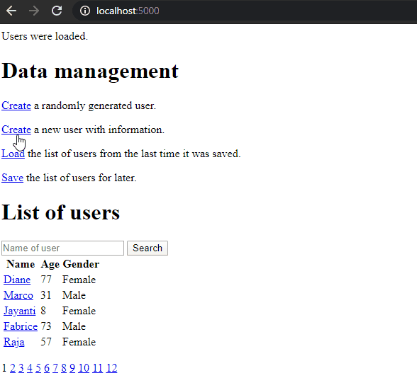

# User Management ASP.NET Core
A simple Web application developed with ASP.NET Core MVC:

* Create the fictional users you've always wanted, or generate random ones if you feel lazy.
* Find them easily through a searchable paginated list.

Quick tour of the features in 30 seconds:

## Technical things
I want this Web application the easiest possible to install and use:

* Store data in a local JSON file rather than in a database to avoid the need of additional softwares.
* HTML is kept to the bare minimum, and there is no CSS, to focus on what is really interesting us ... C#!

## How to run the application
You only need to install SDK for .NET Core 3.1 to build and run the application. Download it [here](https://dotnet.microsoft.com/download).

Open a terminal in the WebUI folder, run the command `dotnet build`, then run the command `dotnet run`.

The application starts with Kestrel's default configuration, accessible at http://localhost:5000/ in your favorite Web broser.

## What this application needs
The app would be closer to a production-grade application with:

* Unit testing
* Logging
* A static error page
* Cleaner code in some places
